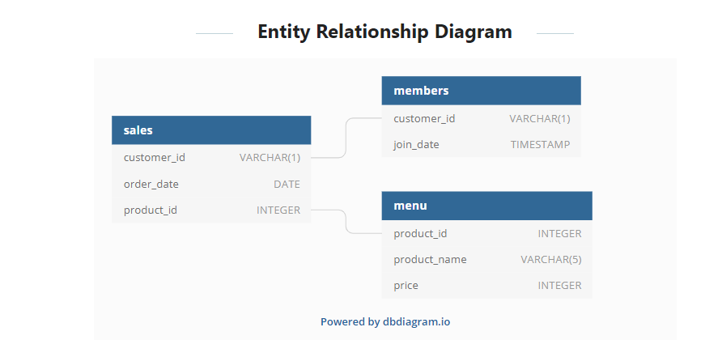

[![LinkedIn][linkedin-shield]][https://www.linkedin.com/in/tho-tran-anh-6954001ba/]

<!-- PROJECT LOGO -->
 

  

  <h3 align="center">CASE STUDY 1</h3>

  

    Danny's Diner
  

<!-- TABLE OF CONTENTS -->

  
<h2 style="display: inline-block">Table of Contents</h2>

  <ol>
    <li>
      <a href="#about-the-project">About The Casestudy</a>
    </li>
  </ol>
    <ol>
    <li>
      <a href="#about-the-project">Available Data</a>
    </li>
  </ol>

<!-- ABOUT THE PROJECT -->
## About The Casestudy
Danny seriously loves Japanese food so in the beginning of 2021, he decides to embark upon a risky venture and opens up a cute little restaurant that sells his 3 favourite foods: sushi, curry and ramen.

Danny’s Diner is in need of your assistance to help the restaurant stay afloat - the restaurant has captured some very basic data from their few months of operation but have no idea how to use their data to help them run the business.
<!-- GETTING STARTED -->
## Available  Data

The Data Bank team have prepared a data model for this case study as well as a few example rows from the complete dataset below to get you familiar with their tables.  

  <ol>
    <li>
      Table 1: Sales
    </li>
  </ol>
    <ol>
    <li>
      Table 2: Member
    </li>
  </ol>
      <ol>
    <li>
      Table 3: Menu
    </li>
  </ol>
View Case study: 
<link>https://8weeksqlchallenge.com/case-study-1/</link>

[linkedin-url]: https://linkedin.com/in/github_username
