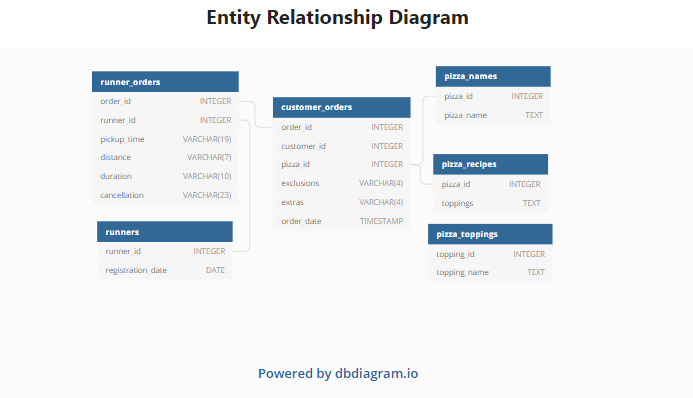

[![LinkedIn][linkedin-shield]][https://www.linkedin.com/in/tho-tran-anh-6954001ba/]

<!-- PROJECT LOGO -->
 

  

  <h3 align="center">CASE STUDY 2</h3>

  

    Pizza Runner
  

<!-- TABLE OF CONTENTS -->

  
<h2 style="display: inline-block">Table of Contents</h2>

  <ol>
    <li>
      <a href="#about-the-project">About The Casestudy</a>
    </li>
  </ol>
    <ol>
    <li>
      <a href="#about-the-project">Available Data</a>
    </li>
  </ol>

<!-- ABOUT THE PROJECT -->
## About The Casestudy
Did you know that over 115 million kilograms of pizza is consumed daily worldwide??? (Well according to Wikipedia anyway…)

Danny was scrolling through his Instagram feed when something really caught his eye - “80s Retro Styling and Pizza Is The Future!”

Danny was sold on the idea, but he knew that pizza alone was not going to help him get seed funding to expand his new Pizza Empire - so he had one more genius idea to combine with it - he was going to Uberize it - and so Pizza Runner was launched!

Danny started by recruiting “runners” to deliver fresh pizza from Pizza Runner Headquarters (otherwise known as Danny’s house) and also maxed out his credit card to pay freelance developers to build a mobile app to accept orders from customers.
<!-- GETTING STARTED -->
## Available  Data

All datasets exist within the pizza_runner database schema - be sure to include this reference within your SQL scripts as you start exploring the data and answering the case study questions.  

  
View Case study: 
<link>https://8weeksqlchallenge.com/case-study-2/</link>

[linkedin-url]: https://linkedin.com/in/github_username
