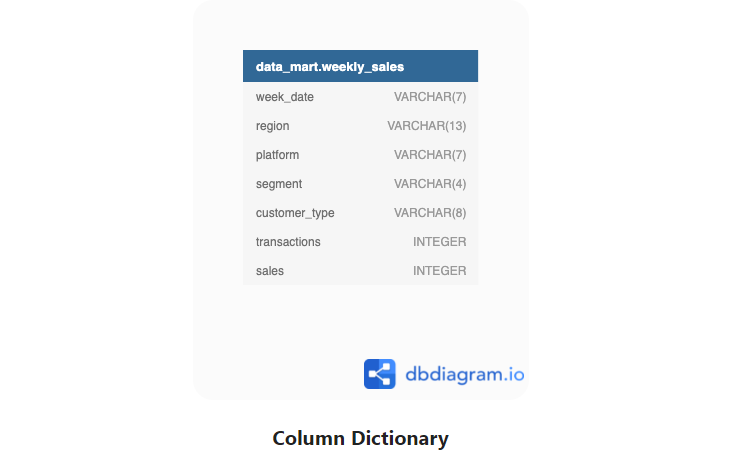

[![LinkedIn][linkedin-shield]][https://www.linkedin.com/in/tho-tran-anh-6954001ba/]

<!-- PROJECT LOGO -->
 

  

  <h3 align="center">CASE STUDY 5</h3>

  

    DATA-MART
  

<!-- TABLE OF CONTENTS -->

  
<h2 style="display: inline-block">Table of Contents</h2>

  <ol>
    <li>
      <a href="#about-the-project">About The Casestudy</a>
    </li>
  </ol>
    <ol>
    <li>
      <a href="#about-the-project">Available Data</a>
    </li>
  </ol>

<!-- ABOUT THE PROJECT -->
## About The Casestudy
Data Mart is Danny’s latest venture and after running international operations for his online supermarket that specialises in fresh produce - Danny is asking for your support to analyse his sales performance.

In June 2020 - large scale supply changes were made at Data Mart. All Data Mart products now use sustainable packaging methods in every single step from the farm all the way to the customer.

Danny needs your help to quantify the impact of this change on the sales performance for Data Mart and it’s separate business areas.

The key business question he wants you to help him answer are the following:

What was the quantifiable impact of the changes introduced in June 2020?
Which platform, region, segment and customer types were the most impacted by this change?
What can we do about future introduction of similar sustainability updates to the business to minimise impact on sales?
<!-- GETTING STARTED -->
## Available  Data

For this case study there is only a single table: data_mart.weekly_sales

The Entity Relationship Diagram is shown below with the data types made clear, please note that there is only this one table - hence why it looks a little bit lonely!

 

      Table 1: Regions

View Case study: 
<link>https://8weeksqlchallenge.com/case-study-5/</link>

[linkedin-url]: https://linkedin.com/in/github_username
